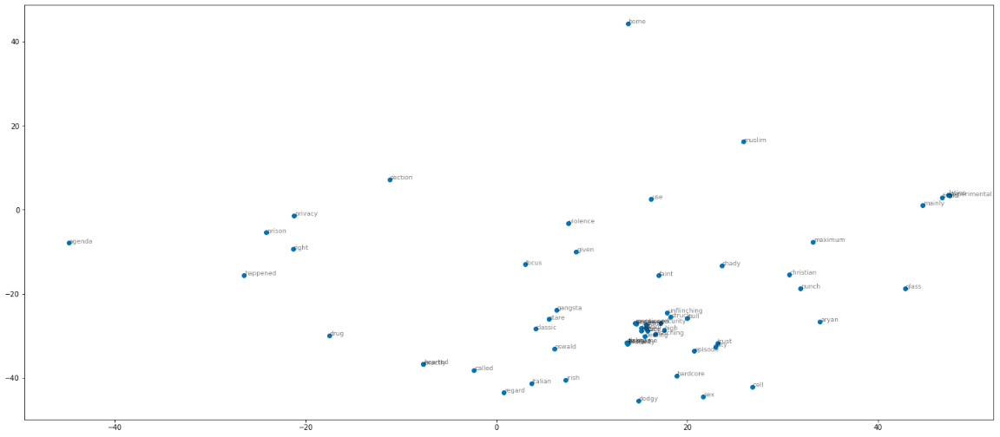

## Classification of reviews from IMDB

IMDB dataset having 50K movie reviews for natural language processing or Text analytics.
This is a dataset for binary sentiment classification containing substantially more data than previous benchmark datasets. We provide a set of 25,000 highly polar movie reviews for training and 25,000 for testing. Predict the number of positive and negative reviews using either classification or deep learning algorithms.

* preprocessing:
  * convert all characters to lower case
  * remove punctuation
  * remove numbers
  * lemmatizer
  * tokenizer
  * stopwords
* model
  * LogisticRegression
  * RandomForestClassifier
  * keras (LSTM layers)
* word2vec visualization

